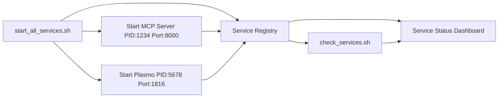

# Service Integration Guide

## Overview

The service management system now features **integrated communication** between `start_all_services.sh` and `check_services.sh` through a shared **Service Registry**. This eliminates hardcoded ports and service detection guesswork.

## Key Components

### 1. Service Registry (`.service_registry.json`)
A JSON file that acts as the central source of truth for all running services:

```json
{
  "services": {
    "mcp_server": {
      "pid": 12345,
      "port": 8000,
      "url": "http://localhost:8000",
      "health_endpoint": "http://localhost:8000/health",
      "status": "running",
      "start_time": "2025-06-10 15:30:45",
      "log_file": "logs/mcp_server.log"
    },
    "plasmo_dev": {
      "pid": 67890,
      "port": 1816,  // Dynamically detected!
      "url": "http://localhost:1816",
      "status": "running",
      "port_range": [1815, 1816, 1817, 1818]
    }
    // ... other services
  }
}
```

### 2. Service Utilities (`service_utils.sh`)
Shared functions for both scripts:

- **`update_service()`**: Updates service information in registry
- **`get_service_info()`**: Retrieves service information from registry
- **`is_service_running()`**: Checks if service is actually running
- **`detect_plasmo_port()`**: Dynamically detects Plasmo's port
- **`cleanup_registry()`**: Removes dead processes from registry

### 3. Enhanced Start Script (`start_all_services.sh`)
Now **writes** to the registry when starting services:

```bash
# When starting MCP server
nohup python3 mcp_server.py --port 8000 > logs/mcp_server.log 2>&1 &
MCP_PID=$!
update_service "mcp_server" "$MCP_PID" "8000" "running"

# When starting Plasmo (with dynamic port detection)
nohup pnpm dev > logs/plasmo_dev.log 2>&1 &
PLASMO_PID=$!
sleep 3  # Give it time to start
PLASMO_PORT=$(detect_plasmo_port "$PLASMO_PID")
update_service "plasmo_dev" "$PLASMO_PID" "$PLASMO_PORT" "running"
```

### 4. Enhanced Check Script (`check_services.sh`)
Now **reads** from the registry instead of guessing:

```bash
# Check MCP Server using registry
if is_service_running "mcp_server"; then
    MCP_PID=$(get_service_info "mcp_server" "pid")
    MCP_PORT=$(get_service_info "mcp_server" "port")
    MCP_URL=$(get_service_info "mcp_server" "url")
    print_status "MCP Server is running (PID: $MCP_PID, Port: $MCP_PORT)"
fi
```

## Integration Benefits

### ✅ **Dynamic Port Detection**
- **Before**: Hardcoded port checks (often wrong)
- **After**: Real-time port detection and registry updates

### ✅ **Accurate Service Status**
- **Before**: Process name guessing with `pgrep`
- **After**: Tracked PIDs with actual process validation

### ✅ **Centralized Service Information**
- **Before**: Each script had its own logic
- **After**: Single source of truth for all service data

### ✅ **Multiple Repository Support**
- Each repository instance can have its own registry
- Services can run on different ports without conflicts
- Easy to identify which repository a service belongs to

## Communication Flow



## Integration Workflow

1. **Service Startup**:
   ```bash
   ./start_all_services.sh
   # → Creates/updates .service_registry.json
   # → Records PIDs, ports, URLs, timestamps
   # → Detects dynamic ports (Plasmo)
   ```

2. **Service Checking**:
   ```bash
   ./check_services.sh
   # → Reads .service_registry.json  
   # → Validates actual process status
   # → Updates registry if processes died
   # → Reports accurate port information
   ```

3. **Cross-Script Communication**:
   - Start script tells check script exactly what's running where
   - Check script validates and updates registry with current reality
   - No more guessing or hardcoded assumptions

## Multi-Repository Integration

### Strategy 1: Separate Service Instances
Each repository runs its own services on different ports:

```json
// Repository A (.service_registry.json)
{
  "services": {
    "mcp_server": {"port": 8000},
    "socketio_server": {"port": 3001},
    "plasmo_dev": {"port": 1816}
  },
  "repository_id": "project-a"
}

// Repository B (.service_registry.json)  
{
  "services": {
    "mcp_server": {"port": 8001},
    "socketio_server": {"port": 3002}, 
    "plasmo_dev": {"port": 1817}
  },
  "repository_id": "project-b"
}
```

### Strategy 2: Central Registry Discovery
Create a discovery service that aggregates multiple registries:

```bash
# discover_services.sh
find /path/to/projects -name ".service_registry.json" | \
  while read registry; do
    echo "=== $(dirname $registry) ==="
    jq '.services | to_entries[] | select(.value.status == "running")' "$registry"
  done
```

## Usage Examples

### Check Specific Service
```bash
source ./service_utils.sh
if is_service_running "plasmo_dev"; then
  port=$(get_service_info "plasmo_dev" "port")
  echo "Plasmo is running on port $port"
fi
```

### Get All Running Services
```bash
source ./service_utils.sh
get_all_services | jq -r 'to_entries[] | select(.value.status == "running") | "\(.key): \(.value.port)"'
```

### Integration Endpoint URLs
- **MCP Server**: `http://localhost:$(get_service_info "mcp_server" "port")`
- **Socket.IO Server**: `http://localhost:$(get_service_info "socketio_server" "port")`
- **Service Registry API**: Could be extended to provide REST endpoints

## Future Enhancements

1. **REST API**: Expose registry data via HTTP endpoint
2. **Service Discovery**: Automatic discovery of services across repositories
3. **Health Monitoring**: Continuous health checks with notifications
4. **Service Dependencies**: Define startup order and dependencies
5. **Load Balancing**: Route requests between multiple instances

## Troubleshooting

### Registry Out of Sync
```bash
# Clean up registry
source ./service_utils.sh
cleanup_registry
```

### Missing jq Dependency
```bash
# Auto-installs via service_utils.sh
source ./service_utils.sh
ensure_jq
```

### Port Conflicts
```bash
# Check what's using a port
lsof -i :8000
# Update registry with correct information
update_service "mcp_server" "12345" "8001" "running"
```

This integrated system makes service management **robust**, **dynamic**, and **integration-ready**! 🚀 